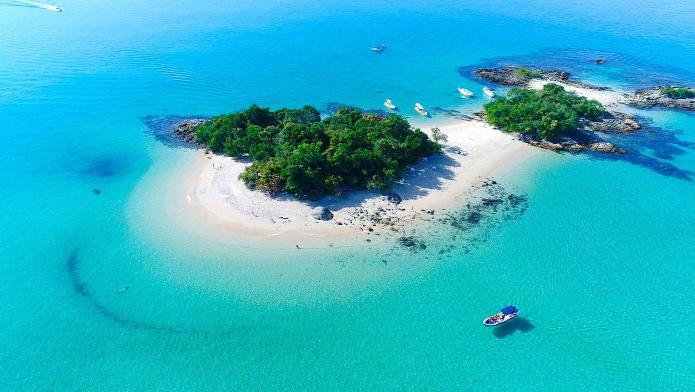

Ilha Grande has around **113 beaches**. It sits in the bay of Angra dos Reis — an archipelago famous for its **365 islands** — so between long white-sand strands, hidden coves and turquoise snorkelling lagoons, you could spend weeks and not see them all. Almost none have roads: you reach them **on foot, along the marked trails, or by boat**.

If you only have a few days, the short answer is: **Lopes Mendes** for the iconic beach, **Lagoa Azul** for snorkelling in calm turquoise water, **Aventureiro** for a wild, end-of-the-world feel, and **Dois Rios** for history and a dramatic setting. Below is how to reach each, and a dozen more worth the trip.

## Quick picks

| Beach | How to reach | Best for |
|---|---|---|
| **Lopes Mendes** | Trail (T10+T11) or schooner to Pouso + T11 | The iconic beach, light surf |
| **Lagoa Azul** | Schooner / speedboat tour | Snorkelling, calm water |
| **Aventureiro** | Boat, or trail (T9) | Wild, rustic, remote |
| **Dois Rios** | Trail (T14) or boat tour | History + scenery |
| **Lagoa Verde** | Schooner / speedboat tour | Snorkelling, families |
| **Palmas** | Trail (T10) | A quiet stop before Lopes Mendes |

## The big names

### Lopes Mendes

The one everyone comes for — and it lives up to it. Nearly **3 km of fine, pale sand** so fine it almost squeaks underfoot, backed by preserved Atlantic forest and lapped by clear, shallow water. It's regularly listed among the best beaches in Brazil (and the world). There's gentle **surf**, which makes it a favourite with beginner surfers, and only a couple of rustic huts selling drinks and snacks — almost no development.

Boats can't land at Lopes Mendes itself. The usual way is a **schooner (escuna) from Abraão to Praia do Pouso** (around R$50 round trip; departures mid-morning, returns mid-to-late afternoon) or a **taxi boat** (around R$70 per person), then the short **T11 trail (~1 km, 30–40 min)** over the headland. You can also walk the whole way on **T10 + T11**. See the full route in our [trails guide](/ilha-grande-trails/).

### Aventureiro

The island's most famous *wild* beach, on the exposed south-western side inside the **Reserva Biológica da Praia do Sul**. Aventureiro is rustic and remote — a former fishing community famous for the iconic wind-bent palm tree leaning over the sand and for its big Atlantic swell. Because it sits inside a strict biological reserve, **surfing is not allowed** here and visitor numbers and camping are regulated. It's reached by **boat** or by trail (T9 from Provetá). Come for the raw, off-grid feel, not for beach bars.

### Dois Rios

A dramatic beach in a cove **between two steep mountains**, framed by the two freshwater rivers that give it its name — their water dark but clean and cool. Behind it lies the haunting near-ghost-town of the old maximum-security prison (1904–1994), now a museum and university campus slowly being reclaimed by the forest. Reached on foot via **T14 (~7 km)** or by boat tour. There's little infrastructure, so bring water and food. Full walking details are in our [trails guide](/ilha-grande-trails/).

## Calm water & snorkelling

### Lagoa Azul

Not a beach but a **shallow, turquoise lagoon** between islets on the north side of the island, with calm, crystal-clear water and reef fish — the island's signature **snorkelling** stop. It's a fixture on almost every schooner and speedboat tour. Bring (or rent) a mask; the calm water is ideal for first-timers and families.

### Lagoa Verde

Another sheltered, green-blue snorkelling lagoon, closer to Abraão, with calm water and plenty of fish. Like Lagoa Azul, it's a standard stop on day-tours and an easy, gentle place to get in the water.

### Dentista & Cataguas

Two small, picture-postcard spots reached **by boat**: tiny beaches and sandbanks with clear, shallow, turquoise water that are popular schooner stops for swimming and snorkelling. Perfect for a short stop on a round-the-island tour.

## Quieter & remote

### Palmas

A calm, pretty beach on the **T10 trail** between Abraão and Pouso — a natural place to pause (and cool off) on the walk to Lopes Mendes.

### Caxadaço

A small, beautiful cove near Dois Rios, reached by trail (**T15**) or boat. It's more than a beach: Caxadaço is also a **viewpoint (mirante)** and a well-known **cliff-jumping** spot into deep, clear water — with good snorkelling among the rocks.

### Parnaioca

One of the most **remote** beaches, on the southern coast — a former fishing village reached by a long trail (**T16** from Dois Rios) or by boat. Big, wild and almost empty; for travellers who want true solitude. There's a simple **campsite** here, so you can pitch a tent and stay the night.

### Meros

A quiet beach on the western side of the island, near the Provetá/Aventureiro area — peaceful, far from the crowds, and with good **snorkelling**.

### Gruta do Acaiá

Not a beach but a striking **sea cave**, half-submerged and reachable **only by boat**. Its magic is the light: when the sun hits the entrance at the right angle, the water inside glows an electric blue, while the sea echoes off rock walls sculpted over thousands of years. It's usually visited on a day-tour that also stops at the snorkelling lagoons (**Lagoa Azul**, **Lagoa Verde**) and the quiet cove of Grumixama.
