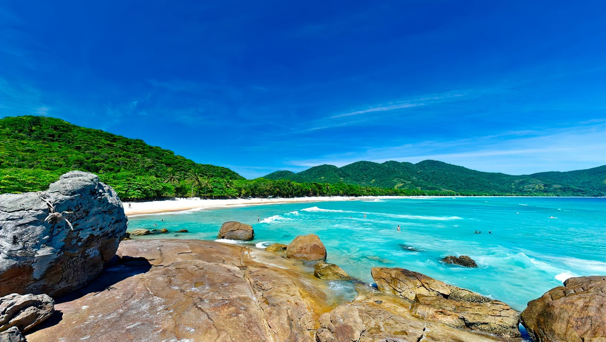
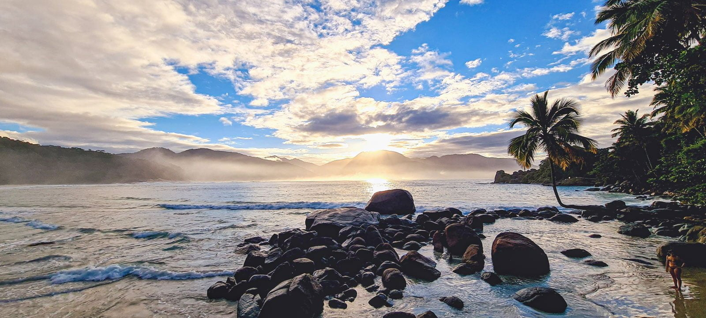
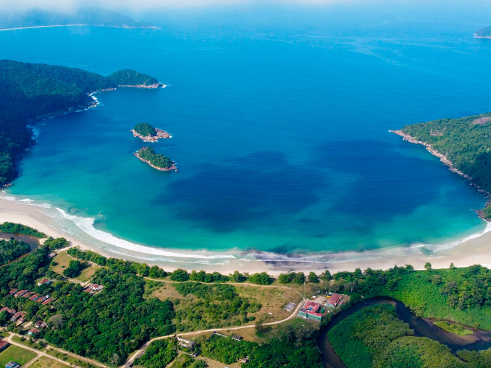
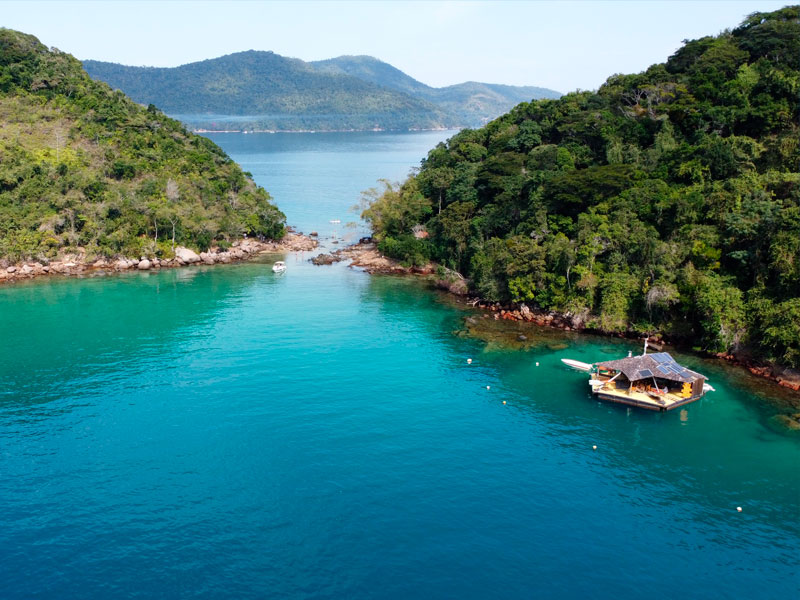
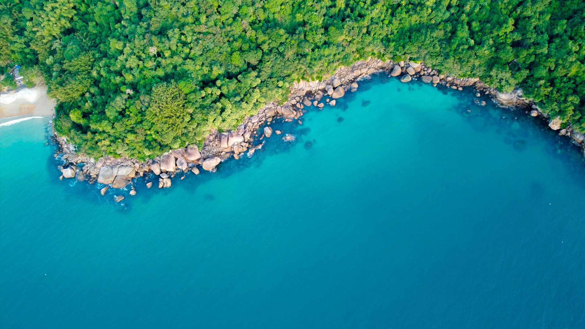
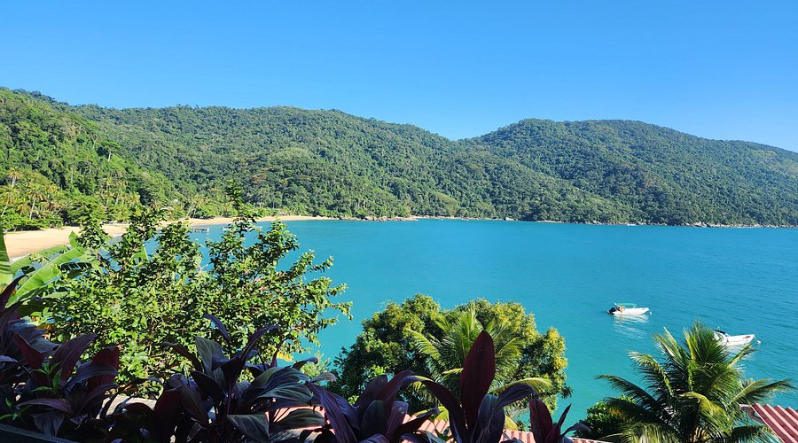
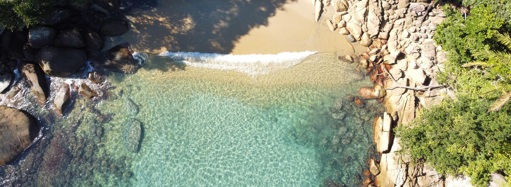
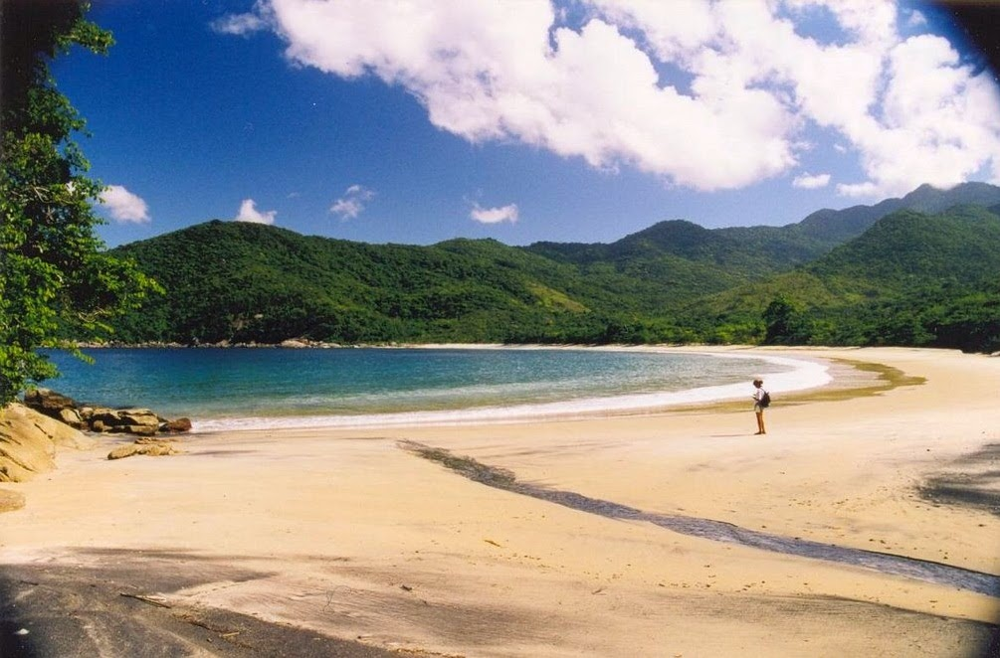
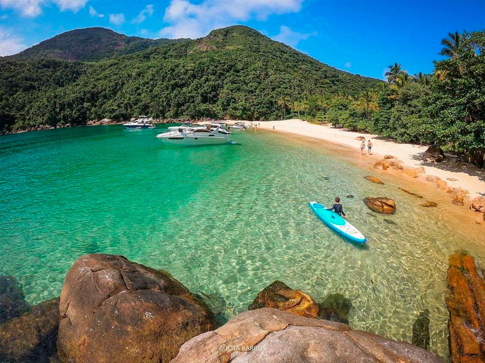
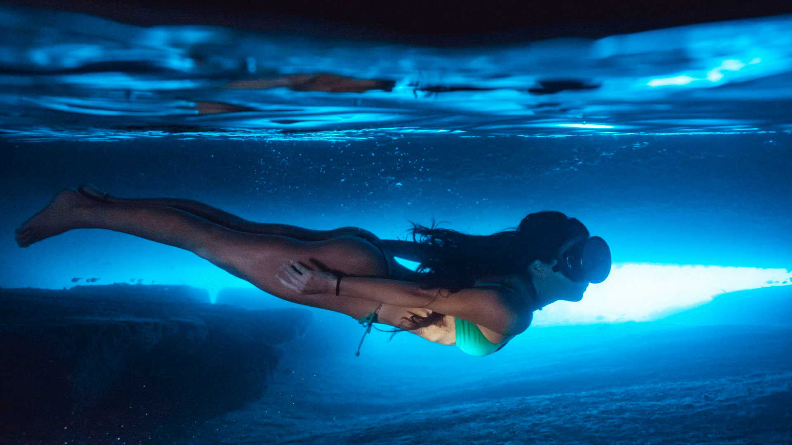

A Ilha Grande tem cerca de **113 praias**. Ela fica na baía de Angra dos Reis — um arquipélago famoso por suas **365 ilhas** — então, entre longas faixas de areia branca, enseadas escondidas e lagoas turquesa, você poderia passar semanas e não ver todas. Quase nenhuma tem estrada: você chega **a pé, pelas trilhas sinalizadas, ou de barco**.

Se você tem só alguns dias, em resumo: **Lopes Mendes** pela praia icônica, **Lagoa Azul** pelo snorkel em água turquesa e calma, **Aventureiro** por um clima selvagem de fim de mundo, e **Dois Rios** pela história e o cenário dramático. Abaixo, como chegar a cada uma e mais uma dúzia que vale a viagem.

## Escolhas rápidas

| Praia | Como chegar | Boa para |
|---|---|---|
| **Lopes Mendes** | Trilha (T10+T11) ou escuna até Pouso + T11 | A praia icônica, ondas leves |
| **Lagoa Azul** | Passeio de escuna / lancha | Snorkel, água calma |
| **Aventureiro** | Barco, ou trilha (T9) | Selvagem, rústica, remota |
| **Dois Rios** | Trilha (T14) ou passeio de barco | História + cenário |
| **Lagoa Verde** | Passeio de escuna / lancha | Snorkel, famílias |
| **Palmas** | Trilha (T10) | Uma parada tranquila antes de Lopes Mendes |

## Praias acessíveis a pé desde o Abraão

A Vila do Abraão é a sua base na ilha, e é o único lugar de onde dá para partir a pé. Quase todo o resto da Ilha Grande se alcança de barco — mas há um trecho surpreendente de costa que você consegue chegar com nada além de um bom calçado e uma garrafa d'água. Aqui vão minhas sugestões, primeiro pelo sentimento; os números para planejamento estão guardados numa linha *Bom saber* sob cada caminhada.

Uma coisa antes de sair: as praias **ao norte** do Abraão são gloriosamente selvagens — sem vendedores, sem quiosques, nenhum lugar para comprar uma bebida ou um lanche — então leve a sua própria comida e água. As praias **a leste** da vila têm mais estrutura, e marquei exatamente onde dá para comer.

### Rumo ao norte: Praia Preta e Praia do Galego

Uma caminhada plana e tranquila, e o escape mais próximo da vila — praiazinhas selvagens onde ninguém tenta te vender nada.

- **Praia Preta** — uma meia-lua selvagem de areia escura, de aparência quase vulcânica, limpa e silenciosa, o escape mais próximo da vila. *~10 min a pé, plano.*
- **Praia do Galego** — tranquila e um pouco mais adiante, com água deliciosamente limpa, alcançada passando o costão do rio e as ruínas do antigo *lazareto* (o histórico hospital de quarentena). *Um pouco além da Praia Preta, plano.*

> **Bom saber.** Todo esse trecho ao norte é o **Circuito Histórico** (trilha T1): praticamente plano, abrangendo o antigo aqueduto, a Praia Preta, a Praia do Galego e as ruínas do *lazareto*. Conte com **40 min** no ritmo de um casal jovem, até **1 h** num ritmo mais leve. Selvagem do começo ao fim — leve a sua própria comida e água.

### Rumo a leste: Júlia, Crena e Abraãozinho

Siga a trilha costeira em direção ao leste e você vai costurando uma série de praias, terminando num dos meus lugares preferidos para um dia relaxado. O caminho é agradável, mas um pouco intrincado e acidentado — exige atenção, o esforço é médio-baixo, e há um trecho peculiar que descrevo abaixo.

- **Praia da Júlia** — a primeira parada, e a que tem um *parador* (bar de praia) e um clima descontraído, de lounge. **É aqui que você come na ida.** *~15 min.*
- **Comprida e Bica** — duas praiazinhas logo depois da Júlia, não especialmente bonitas; a maioria das pessoas simplesmente passa por elas.
- **Praia da Crena** *(bifurcação à esquerda)* — uma enseada calma cuja marca registrada é a água plana, "passada a ferro" — feita para nadar, stand-up paddle e caiaque. *~30 min.*
- **Abraãozinho** *(bifurcação à direita)* — uma faixa longa e larga de areia com ondas suaves e água lindamente cristalina, e **restaurantes na outra ponta**: dois lugares brasileiros em uma extremidade e um ótimo bar-restaurante argentino na outra. Há também um ponto fixo de táxi-boat. *~30 min.*

> **Bom saber.** Caminhada bastante fácil, mas intrincada e acidentada — e escorregadia se tiver chovido. Em certo ponto, casas irregulares bloquearam o caminho original, então uma curta descida te leva até a praia e por uma passagem estreita junto ao costão (uma *cornija*), com degraus e pedras escorregadias equipadas com cordas fixas. É bem divertido, embora não seja para todos — e vale a pena.

> ⚠️ **Marés — faça esse trecho de manhã.** A partir das **15h**, mais ou menos, a maré costuma subir, e na maré alta alguns trechos te obrigam a vadear pela beira d'água — você pode se molhar até a cintura. Faça a caminhada pela costa leste de manhã, ou esteja preparado para se molhar.

> 🚤 **Táxi-boat (Crena / Abraãozinho).** Cerca de **R$50 ida e volta**. Os barcos oficiais são **pretos e amarelos**. Funcionam a partir das **9h30** mais ou menos (não antes — precisam de um número mínimo de passageiros), saem entre **9h30 e 13h** e voltam até por volta das **17h30–18h**. Não saia às 17h30 esperando conseguir carona. Uma ótima opção: **ir a pé e voltar de barco.**

### A caminhada da cachoeira: Cachoeira da Feiticeira

Esta é para as pernas que querem uma subida de verdade. Você sobe suando por uma mata quente e úmida, passando por dois *mirantes* com vista para o mar, e a recompensa lá em cima é a **Cachoeira da Feiticeira** — uma queda d'água e piscina natural que é gloriosa no verão, depois do calor da caminhada. Avance um pouco mais e você desce até a **Praia da Feiticeira**, uma praia pequena e muito bonita.

> **Prático — Feiticeira (trilha T2).** O percurso vai **Abraão → bifurcação do parque → aqueduto → bifurcação da cachoeira → cachoeira → Praia da Feiticeira**. Cerca de **1h30** até a cachoeira, depois mais **20–30 min** de descida até a praia. Perfil: aproximadamente **5 km**, chegando perto dos **220 m**, com **400 m+** de subida acumulada e **dois mirantes**. **Não** tente fazê-la depois da chuva — ela fica traiçoeira. Use boas sandálias ou tênis de trekking (não tênis comum nem chinelos) e leve **1–1,5 L de água** (2 L para dois). Da Praia da Feiticeira você pode pegar um **barco de volta ao Abraão** e poupar a subida de retorno.

### As caminhadas mais longas: Palmas, Lopes Mendes e Dois Rios

Algumas das praias mais famosas da ilha também são alcançáveis a pé desde o Abraão — mas estas são caminhadas de verdade, não passeios. Aqui estão os tempos de caminhada só de ida para ajudar no seu planejamento; cada praia tem a sua própria seção completa em outro ponto deste guia.

| Praia | Trilha(s) | Só de ida, a pé |
| --- | --- | --- |
| **Palmas** | T10 | cerca de **1h40** |
| **Lopes Mendes** | T10 + T11 | cerca de **3h** (2h30 num bom ritmo) |
| **Dois Rios** | T14 | **7,2 km, cerca de 2h30** |

### Uma observação sobre o Aventureiro

Os viajantes costumam perguntar se dá para ir a pé até o **Aventureiro**, lá no extremo sul. Desde o Abraão, a resposta é não — você chega lá **de barco**, ou por terra pela **trilha T9 a partir de Provetá** (cerca de **4,3 km**). Uma coisa que vale saber: uma visita curta não exige autorização, mas permanecer por mais de **duas horas** requer autorização — e é por isso que os passeios de barco normalmente fazem uma parada por ali de cerca de **1h30**.

## As mais famosas

### Lopes Mendes

A praia por que todo mundo vem — e que cumpre o que promete. Quase **3 km de areia fina e clara**, tão fina que quase "canta" sob os pés, com mata atlântica preservada atrás e água clara e rasa. Está sempre nas listas das melhores praias do Brasil (e do mundo). Tem **ondas suaves**, que a tornam queridinha dos surfistas iniciantes, e só algumas barracas rústicas vendendo bebida e petiscos — quase nenhuma estrutura.

Os barcos não atracam na própria Lopes Mendes. O jeito mais comum é uma **escuna do Abraão até a Praia do Pouso** (cerca de R$70 ida e volta) ou um **táxi-boat** mais rápido (cerca de R$100 ida e volta) — veja os horários exatos e as tarifas só de ida no planejador de dias abaixo, e depois a curta **trilha T11 (~1 km, 30–40 min)** por cima do costão. Você também pode fazer todo o caminho pela **T10 + T11**. Veja o trajeto completo no nosso [guia de trilhas](/pt/trilhas-ilha-grande/).

### Aventureiro

A praia **selvagem** mais famosa da ilha, no lado sudoeste exposto, dentro da **Reserva Biológica da Praia do Sul**. Aventureiro é rústica e remota — uma antiga comunidade de pescadores famosa pela icônica palmeira tombada pelo vento sobre a areia e pelas ondas fortes do Atlântico. Por estar dentro de uma reserva biológica rígida, **não é permitido surfar** ali, e o número de visitantes e o camping são regulados. Chega-se de **barco** ou pela trilha (T9 a partir de Provetá). Vá pelo clima cru, fora do mundo, não por quiosques de praia.

### Dois Rios

Uma praia dramática numa enseada **entre dois morros íngremes**, emoldurada pelos dois rios de água doce que dão nome a ela — água escura, mas limpa e fresca. Atrás fica o vilarejo quase fantasma da antiga prisão de segurança máxima (1904–1994), hoje um museu e um campus universitário aos poucos tomado pela mata. Chega-se a pé pela **T14 (~7 km)** ou em passeio de barco. Há pouca estrutura, então leve água e comida. Detalhes completos da caminhada no nosso [guia de trilhas](/pt/trilhas-ilha-grande/).

## Água calma & snorkel

### Lagoa Azul

Não é uma praia, mas uma **lagoa turquesa e rasa** entre ilhotas, no lado norte da ilha, com água calma e cristalina cheia de peixes — a parada de **snorkel** símbolo da ilha, um verdadeiro aquário natural. É presença certa em quase todo passeio de escuna e lancha. Leve (ou alugue) uma máscara; a água calma é ideal para iniciantes e famílias.

### Lagoa Verde

Outra lagoa de snorkel abrigada, de águas esmeralda, mais perto do Abraão, com água calma e muitos peixes e ótima visibilidade submarina. Como a Lagoa Azul, é parada padrão dos passeios de dia e um lugar tranquilo e fácil para entrar na água.

## Mais calmas & remotas

### Palmas

Uma praia calma e bonita na **trilha T10** entre Abraão e Pouso — um lugar natural para uma pausa (e um mergulho) no caminho para Lopes Mendes.

### Caxadaço

Uma pequena enseada linda perto de Dois Rios, alcançada pela trilha (**T15**) ou de barco. É mais que uma praia: Caxadaço é também um **mirante** e um conhecido ponto de **salto dos costões** (clavados) em água funda e clara — com bom snorkel entre as pedras.

### Parnaioca

Uma das praias mais **remotas**, na costa sul — uma antiga vila de pescadores alcançada por uma longa trilha (**T16** a partir de Dois Rios) ou de barco. Grande, selvagem e quase deserta; para quem busca a verdadeira solidão. Há um **camping** simples, para armar a barraca e passar a noite.

### Meros

Uma praia tranquila no lado oeste da ilha, perto da área de Provetá/Aventureiro — pacata, longe das multidões, e com bom **snorkel**.

### Gruta do Acaiá

Não é uma praia, mas uma impressionante **gruta marinha**, semissubmersa e acessível **somente de barco**. Sua magia é a luz: quando o sol bate na entrada no ângulo certo, a água por dentro brilha num azul elétrico, enquanto o mar ressoa em paredes de rocha esculpidas pelas águas ao longo de milhares de anos. Costuma ser visitada num passeio de dia que também para nas lagoas de snorkel (**Lagoa Azul**, **Lagoa Verde**) e na enseada tranquila de Grumixama.

## Passeios de barco: a ilha pelo mar

A maior parte da Ilha Grande nunca conheceu uma estrada. As praias que fazem você parar no meio de uma frase — enseadas turquesa, baías de mergulho onde os peixes vêm até você, grutas marinhas que brilham — ficam num litoral que só dá para alcançar de barco. Um dia de barco aqui é o mais perto que dá de ver a ilha como os pescadores caiçaras sempre viram: devagar, a partir da água, uma baía de cada vez. Se você fizer só um passeio durante a sua estadia, este é o dia cujas fotos você vai mostrar para as pessoas por anos.

Alguns desses lugares também dá para chegar a pé (e a um deles eu insistiria que você fosse caminhando — mais sobre isso abaixo), mas o sul de mar aberto, as lagoas calmas do norte e as ilhas externas do arquipélago de Angra são território de barco. Todos os passeios partem do píer do **Abraão**, a poucos minutos da vila.

> **Antes de reservar.** Considere qualquer passeio de barco como o seu **dia inteiro** — eles começam no fim da manhã e voltam no fim da tarde, então planeje apenas o café da manhã e o jantar em torno deles. Cada passeio encadeia cerca de **cinco paradas** (mais ou menos quatro praias ou pontos turísticos mais uma parada para o almoço, cada uma com cerca de uma hora). E lembre-se: **os barcos não podem navegar depois do anoitecer**, então ninguém volta mais tarde do que por volta das 17h30. Comece cedo e reserve com um ou dois dias de antecedência — os bons lotam.

### Sul de mar aberto: as praias do Atlântico (Super Sul, Volta à Ilha)

Este é o lado de tirar o fôlego — a costa atlântica selvagem, a água mais procurada e mais bonita da ilha. Se você quer as praias de azul em degradê, de fim de mundo, é para o sul que se vai.

A **Super Sul** é a coletânea dos destaques do sul num único dia: um rápido olá a **Lopes Mendes** (a praia icônica), um mergulho na **Ilha de Jorge Grego** (uma ilhota de mergulho), o mirante no alto do penhasco do **Caxadaço** — onde o degradê de cores é sinceramente melhor do que a praiazinha lá embaixo — e uma parada para o almoço na histórica **Vila de Dois Rios**.
*Paradas: Lopes Mendes · Jorge Grego · Caxadaço · Dois Rios (almoço).*

> **Uma palavra sobre Dois Rios de barco.** Chegar lá de barco significa fazer uma transferência para um barco local da vila em mar aberto, e a cozinha minúscula não foi feita para um grupo de passeio — as esperas podem comer boa parte da sua parada. **Eu iria a pé até Dois Rios em vez de correr no barco — veja o guia de trilhas.** A vila, seus rios e o antigo museu do presídio merecem horas sem pressa, não um almoço apressado.

A **Volta à Ilha** é o grande passeio — a volta completa em torno de toda a ilha, e o dia mais longo na água. Você sente a escala e a natureza selvagem do lugar. Ela liga o **Caxadaço** (mirante no alto do penhasco) a duas das melhores praias do sul, **Parnaioca** (água turquesa espetacular) e **Aventureiro** (lar da famosa palmeira inclinada a 90°, que os viajantes mais experientes vão reconhecer de um antigo papel de parede do Windows), e depois encerra a parte marítima em **Meros** (uma baía de mergulho onde os pescadores deixam seus barcos descansando, então os peixes se juntam perto da costa). A vida marinha da costa oeste é a estrela discreta deste passeio.
*Paradas: Caxadaço · Parnaioca · Aventureiro · Meros · almoço.*

> **Almoço — leve o seu.** Em quase todos os passeios, o almoço **não está incluído**, e o ponto de almoço é uma plateia cativa escolhida pelo marinheiro — sem avaliações no Booking ou no Google para manter o lugar honesto — então o custo-benefício e a qualidade podem ser irregulares. Meu conselho: leve seus próprios sanduíches, frutas, lanches e bebidas, e não tenha vergonha disso. Se você comer fora, atenção ao básico — isto é o Brasil, a água da torneira não é potável, e eu desconfiaria de camarão ou gelo. Ninguém quer passar a segunda metade das férias passando mal.

### O norte calmo: as duas lagoas (Meia Volta, Gruta do Acaiá)

A glória do norte é sua água protegida. As duas lagoas — a **Lagoa Azul**, valorizada pela transparência, e a **Lagoa Verde**, onde quase sempre há tartarugas por perto e a cor da água muda drasticamente — oferecem o mergulho mais calmo e mais cristalino da ilha, perfeito para famílias e para quem nada com receio. *(Uma nota de honestidade sobre a Lagoa Azul: obras recentes nas redondezas começaram a perturbar o fluxo natural da água.)*

A **Meia Volta** é a meia-volta tranquila — uma introdução fácil e bonita ao lado calmo, abrangendo as duas lagoas mais a **Praia do Amor** e a **Praia da Feiticeira** (aquela à qual também dá para chegar a pé). Um primeiro dia delicioso na água, caso o mar aberto pareça demais.
*Paradas: Lagoa Azul · Lagoa Verde · Praia do Amor · Praia da Feiticeira.*

A **Gruta do Acaiá** é a versão turbinada — e a coisa mais memorável que você pode fazer no lado calmo, desde que você não seja claustrofóbico. A própria **Gruta do Acaiá** é uma gruta marinha com água luminescente: você entra na rocha por uma rampa de cerca de **50° de inclinação** (uma ladeira, não uma temperatura), precisa engatinhar, e o ponto mais estreito tem apenas **80 cm** de largura. A recompensa é deslumbrante — água que brilha em azul ou verde, às vezes fosforescente, pela refração da luz dentro da fenda. O passeio combina isso com as duas lagoas e a minúscula e pitoresca enseada de **Grumixama** (uma enseada minúscula).
*Paradas: Gruta do Acaiá · Lagoa Verde · Lagoa Azul · Grumixama.* (Alguns operadores fazem uma versão mais cedo — veja a tabela.)

> **Dica — vale a pena perseguir a saída cedo.** A versão mais cedo do passeio da Gruta leva você aos dois pontos mais a oeste (a gruta e a Lagoa Verde) **antes da multidão**, e funciona como um plano perfeito para o dia do check-out: se a sua pousada oferecer late check-out, dá para estar de volta no meio da tarde para um banho quente e uma toalha limpa antes do seu transfer da noite.

### As ilhas de Angra: o arquipélago das celebridades (Ilhas Paradisíacas)

Ao norte da ilha, em direção a Angra dos Reis, ficam as ilhas de cartão-postal da região da Gipoia — deslumbrantes, calmas e que valem muito a viagem. O passeio **Ilhas Paradisíacas** visita esse arquipélago; embora percorra as águas da Gipoia perto de Angra, ele ainda parte do píer do **Abraão**.

A parada de destaque é a **Piedade (Ilha da Piedade)** — a famosa *"Ilha de Caras"*, batizada em homenagem à *Caras*, a revista de celebridades lida em toda a América Latina. Todo mundo quer a foto na sua capelinha onde as estrelas posaram. Se isso não significa nada para você, saiba que você não está sozinho.

> **Dica para estrangeiros — troque a Piedade.** Se caçar celebridades não é a sua praia, peça uma versão que troque a **Piedade** pela **Lagoa Azul** ou pela **Praia de Flechas** (eu posso ajudar a organizar). Esse roteiro lhe dá o **Aventureiro**, a impressionante ilhota de areia branca de **Cataguás**, as piscinas naturais de mergulho das **Botinas** e, depois, ou a **Praia de Flechas** ou um pôr do sol na **Lagoa Azul**.

> ☀️ **Apenas em dias de sol.** Este é um passeio para guardar para o tempo limpo — simplesmente não vale a pena fazer sob nuvens ou chuva.

### Passeios alternativos (Jerónimo, Caipirinha, Passeio do Índio, fretamento privado)

Nem todo dia na água precisa ser o circuito padrão de lancha. Alguns têm personalidade própria de verdade.

O **passeio do Jerónimo** é o descontraído, levemente hippie, feito numa **traineira** tradicional com um guia trilíngue. Você sobe a pé para ver a **Freguesia de Santana** (um povoado histórico), passeia ao longo da linda praia da Freguesia de Fora, passa a tarde na **Lagoa Azul** e almoça no **Saco do Céu**, com caiaque, mergulho e SUP de brinde. O mais importante: é **um dos pouquíssimos passeios que inclui o almoço** — fácil de organizar e que vale muito a pena.

O **passeio Caipirinha** é o barco da festa — um anfitrião "Jack Sparrow", caipirinhas grátis para todos, navegando numa **escuna ou galeão**. Frequente na alta temporada, almoço a bordo opcional (pago à parte ou comprado antecipadamente).

O **Passeio do Índio** acontece numa canoa canadense — à noite para ver o plâncton luminescente, de dia em viagens personalizadas. Uma alternativa adorável e discreta, e que vale a pena.

O **fretamento privado de barco** é a opção da liberdade: até 10 passageiros (oito é o número confortável para dividir o custo), totalmente personalizado — **duas a quatro horas por ponto** em vez da hora apressada, uma saída mais cedo e um retorno um pouco mais tarde. A única regra inflexível continua valendo: nada de voltar depois do anoitecer, por volta das 17h30.

### Num relance: passeios, roteiros e preços aproximados

Os preços abaixo são **aproximados, por pessoa e oscilam** conforme a temporada — encare-os como um guia, não como um orçamento. Uma coisa que surpreende as pessoas: **a Super Sul custa mais do que a Volta à Ilha, que é mais longa — e não é erro de digitação.** É o único passeio que cruza mar aberto até a **Ilha de Jorge Grego**, o que exige um barco maior e mais potente (e mais caro) do que o dos outros. Onde uma célula diz *consultar na reserva*, o detalhe varia de verdade e é melhor confirmar na hora.

| Passeio | Roteiro numa frase | Horário | ~Preço/pessoa | Almoço |
|---|---|---|---|---|
| **Super Sul** (lancha) | Destaques do Atlântico sul | 10h30–17h00 | ~R$300 | Não incluído |
| **Volta à Ilha** (lancha) | Volta completa em torno da ilha | 09h30–17h30 (o mais longo, ~8 h) | ~R$200 | Não incluído |
| **Meia Volta** (lancha) | Meia-volta tranquila, as duas lagoas | 10h30–16h30 (~6 h) | ~R$150 | Não incluído |
| **Gruta do Acaiá** (lancha) | Gruta marinha + as duas lagoas | 10h30–17h30 (algumas 09h00–16h00, ~7 h) | ~R$200 | Não incluído |
| **Ilhas Paradisíacas** (lancha) | Ilhas de Angra/Gipoia | 10h30–17h30 | ~R$170–180 | Não incluído |
| **Jerónimo** (traineira) | Freguesias, Lagoa Azul, Saco do Céu | 09h30, ~7–8 h (flexível) | ~R$250 | **Incluído** |
| **Caipirinha** (escuna/galeão) | Cruzeiro festivo, caipirinha grátis | 11h30–17h30 | Consultar na reserva | Opcional (pago/comprado antes) |
| **Passeio do Índio** (canoa canadense) | Plâncton à noite, sob medida de dia | Saída ~5–6h (flexível) | Consultar na reserva | Consultar na reserva |
| **Fretamento privado** (barco sob medida) | Totalmente personalizado, até 10 pessoas | Sob medida (sem retorno depois das ~17h30) | ~R$1.500/passeio (~R$1.400–2.000) | Consultar na reserva |

Não citei nomes de operadores aqui de propósito — quando você estiver pronto para reservar, eu indico o capitão certo para o dia e as condições.

## De quantos dias você precisa?

De cinco a sete dias é o ideal — mas, sejam quais forem as suas datas, veja aqui como aproveitar ao máximo.

### Só 2–3 dias? Seu roteiro rápido

Viagem curta? Mesmo assim dá para conhecer o melhor da ilha. Aqui vai a versão sem complicação:

- **Dia 1 — Lopes Mendes.** A praia que você não pode deixar de ver (veja como mais abaixo).
- **Dia 2 — Um passeio de barco.** Se o dia estiver cinzento, faça a **Volta à Ilha** (o circuito completo pela ilha). Se estiver ensolarado, deixe a volta para outra hora e escolha um passeio que aproveite melhor o sol.
- **Dia 3 (se você tiver) — o Circuito Histórico (trilha T1).** Plano, fácil e bom para todo mundo.

**Quatro dias?** Acrescente um segundo passeio de barco — a **Gruta do Acaiá** (o passeio à gruta marinha) ou as **Ilhas Paradisíacas** (as ilhas de Angra). Mais sobre os dois logo abaixo.

### O passeio imperdível: Lopes Mendes

Aconteça o que acontecer no resto da viagem, conheça **Lopes Mendes.** Há duas formas de chegar:

- **A pé** — trilhas **T10 + T11** (as trilhas de Lopes Mendes), cerca de **3 h só de ida** (2h30 num ritmo bom). Seja honesto consigo mesmo: esta é uma caminhada de verdade pela mata, razoavelmente puxada, e não um passeio tranquilo — e a volta é a parte mais lenta e mais difícil.
- **De barco + uma caminhada curta** — pegue um barco de manhã para a travessia e depois ande apenas **~1 km** até a praia, mais os mesmos ~1 km de volta para pegar um barco de retorno.

Uma linha para se orientar: a **escuna** sai dos **Mangues** e o **táxi-boat** sai do lado do **Pouso** — os dois cais ficam a cerca de 5 minutos de caminhada um do outro e são sinalizados, então é praticamente impossível errar.

**Opções de barco de volta** *(as tarifas abaixo são aproximadas, por pessoa, e variam)*

| Barco | Sai de | Horário | Travessia de volta | Só ida | Ida e volta |
|---|---|---|---|---|---|
| **Escuna / galeão** | Mangues | Só uma volta, **15h30** | ~1 h | **R$35** | **R$70** |
| **Táxi-boat** | Lado do Pouso | **15h, 16h e 17h** em ponto | **~15 min** | **R$60** | **R$100** |

**Clima:** Lopes Mendes é linda mesmo em dia nublado — então não desperdice uma manhã cinzenta esperando o sol aparecer. Só não faça o trajeto **a pé** na chuva ou no dia seguinte a uma chuva forte; nesses casos, vá de barco.

### Deixe o céu decidir o seu roteiro

A maneira mais inteligente de organizar os dias aqui é deixar o tempo escolher a ordem. Olhe o céu e a previsão na véspera — se o amanhã estiver com cara de nublado, faça dele o seu dia de **Volta à Ilha**.

- **Um dia cinzento / nublado → Volta à Ilha** *(o circuito completo pela ilha).* O passeio coringa: um dia inteiro na água, paradas lindas ao longo de toda a volta, e você chega em casa cansado, bronzeado e feliz. **Cerca de 8 horas (09h30–17h30), ~R$200.**

- **Seu segundo dia de barco → escolha pelo que você quer.**
  - **Quer aventura → Gruta do Acaiá** *(o passeio à gruta marinha).* Duas lagoas onde você vai cansar de contar peixes, mais uma gruta luminescente que você não encontra em nenhum outro lugar. **Cerca de 7 horas, ~R$200.**
  - **Quer ilhas de cartão-postal, com cara de Caribe → Ilhas Paradisíacas** *(as ilhas de Angra).* Água calma e deslumbrante, uma ótima parada de mergulho com snorkel em **Botinas** e a parada principal, a **Ilha da Piedade** — a famosa "Ilha de Caras." **10h30–17h30, ~R$170–180.**

- **Um dia livre ou extra → pegue leve em terra.**
  - **O Circuito Histórico (trilha T1)** *(o circuito histórico plano)* é excelente para todos — inclusive para quem está cansado, é mais idoso ou quer um dia mais tranquilo — porque é plano e fácil.
  - Acrescente a **cachoeira da Feiticeira (trilha T2)** *(a subida da Feiticeira)* se você estiver a fim de um pouco mais de esforço; vale muito a pena.
  - Ou vá até **Abraãozinho** e/ou **Crena** — dá para chegar a pé ou de barco.

*Todos os detalhes dessas caminhadas e passeios estão nas seções de trilhas e passeios de barco acima.*

### Por que 5–7 dias?

Você consegue ver os destaques em dois ou três dias, mas alguns dias a mais transformam uma boa viagem em uma viagem inesquecível:

- **O tempo não é garantido.** O sol vai e vem por aqui, então quanto mais dias você tiver, mais dias de bom tempo vai pegar — e mais fácil fica deixar o céu decidir o seu roteiro.
- **Há muito mais para fazer do que você imagina.** Praias, trilhas e passeios de barco se acumulam rápido; dias extras raramente são desperdiçados.
- **Isso dilui o seu custo de viagem.** Chegar até aqui não é barato (a ida e a volta, mais a taxa de turismo de Angra), e esses são custos fixos. Como num voo de longa distância, quanto mais tempo você fica, mais cada dia compensa — três dias mal pagam o esforço; uma semana ou duas valem de verdade. O dia a dia, alimentação incluída, é a parte barata.
