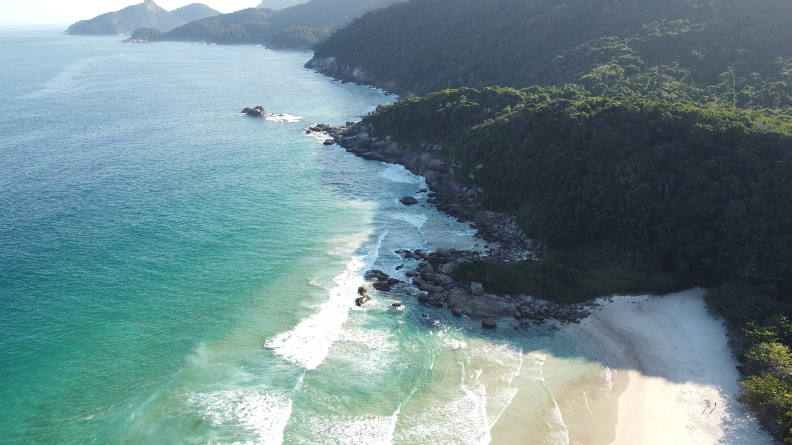
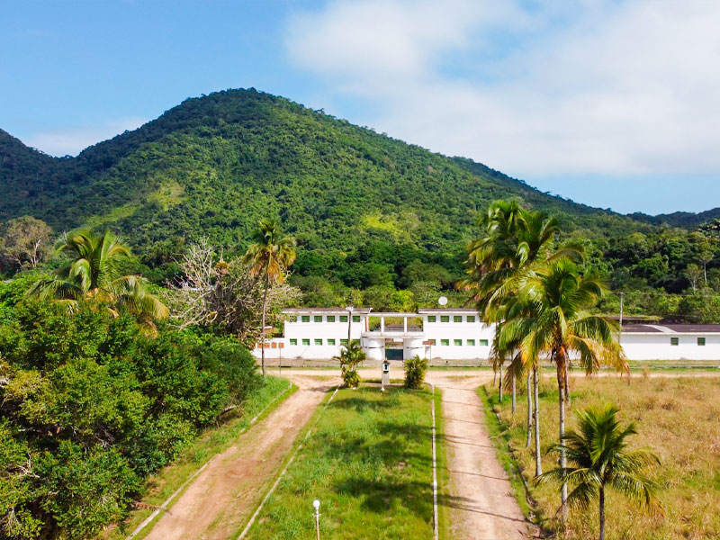
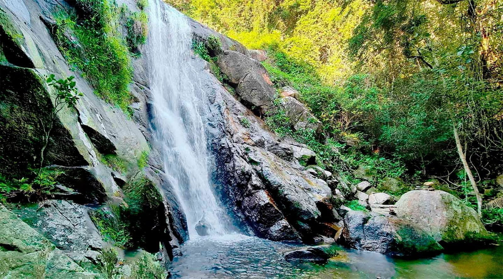
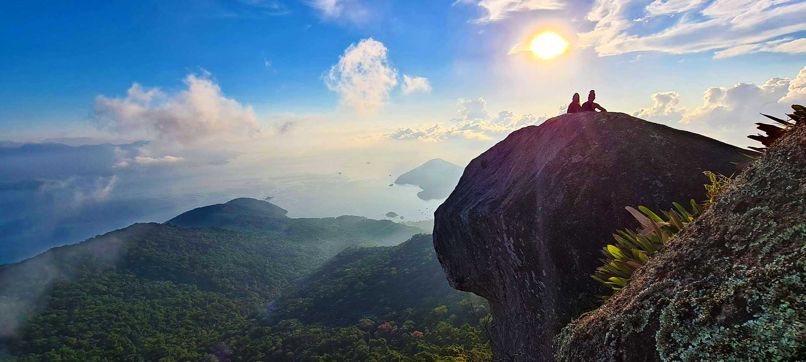
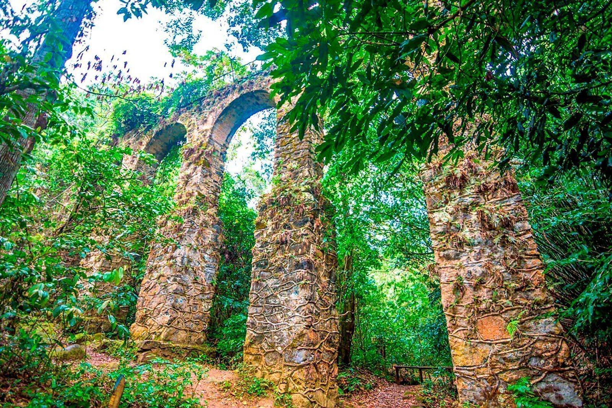

Ilha Grande is, before anything else, a hiking island. There are no cars — just a network of **marked forest trails** (the numbered "T" trails, T1 to T16) that link Vila do Abraão to empty beaches, waterfalls, 19th-century ruins and a 982-metre peak. Almost every walk starts a few minutes from the Abraão pier, and they are all **free**.

Below are the **five trails I'd send any guest on**, from an easy family stroll to a serious all-day climb. For most of them you don't need a guide — just water, decent shoes and an early start. The one real exception is Pico do Papagaio, where a local guide is strongly recommended.

## The five trails at a glance

| Trail | Distance | Time | Difficulty | Why go | Route |
|---|---|---|---|---|---|
| **Lopes Mendes** (T10 + T11) | ~7.2 km | 2h30–3h15 | Moderate–Hard | The island's iconic beach | [Wikiloc](https://pt.wikiloc.com/trilhas-trekking/abrao-x-lopes-mendes-192228271) |
| **Dois Rios** (T14) | ~7 km | ~2.5 h | Moderate | History + a wild beach | [Wikiloc](https://pt.wikiloc.com/trilhas-trekking/abraao-x-dois-rios-100261143) |
| **Feiticeira** (T1 + T2) | ~6.4 km | 90 min–2 h | Moderate | Ruins, waterfall, beach | [Wikiloc](https://www.wikiloc.com/hiking-trails/vila-do-abraao-x-cachoeira-feiticeira-x-praia-da-feiticeira-96855064) |
| **Pico do Papagaio** (T13) | ~12 km round | 6–8 h | Hard (guide!) | The big summit view | [Wikiloc](https://pt.wikiloc.com/trilhas-trekking/ilha-grande-rj-abraao-x-pico-do-papagaio-x-abraao-175144779) |
| **Historic Circuit** (T1) | ~1.8–3 km | 1–2 h | Easy–Moderate | History, easy, family | [Wikiloc](https://pt.wikiloc.com/trilhas-trekking/abraao-x-praia-preta-x-ruinas-186822608) |

## Before you go: safety & what to bring

The trails are wonderful but it is still real rainforest — and the island has a few honest quirks worth knowing before you set off. None of this is meant to worry you: Ilha Grande is one of the most peaceful places I know. It's just the stuff I'd tell a guest over breakfast.

**On the trail.**

- **Start early** — before 8–10am. You avoid the heat, the afternoon rain and the risk of finishing in the dark.
- **Carry at least 2 litres of water** per person. Most trails have no drinking water.
- **Wear proper hiking shoes.** After rain the ground is slippery and you'll often grab roots, branches and rocks — keep your hands free.
- **Check the forecast** before leaving, and tell someone your plan.
- **Respect the markings** and don't leave the signed trail — this is how people get lost.

**Health & bugs.**

- **Pack repellent and sunscreen, and reapply both.** There are plenty of mosquitoes here, but the good news is bigger: **no endemic diseases and no current outbreaks** — the bites are a nuisance, not a danger. The sunscreen matters because the open beaches and summits give you very little shade.

**Money.**

- **No ATMs on the island** — and changing foreign currency here is a poor deal, so sort out any cash you want on the mainland before you cross.
- **You don't need to ration cash for the way back.** The boat back from Lopes Mendes, for example, **takes card** — and if there's no phone signal out there (usually there isn't), they board you anyway and charge you back in Abraão, where the signal is fine.
- **Set a daily card limit if you like** — never a bad idea anywhere in Brazil. Beyond that, relax: the island is extremely peaceful, with no scams, no theft, no robbery.

**Pay the Taxa Viva (Angra's visitor fee) — don't dodge it.**

You'll be offered plenty of ways to skip the fee by boarding or landing at clandestine (unofficial) spots, and some people do arrive that way. I'll be honest: I don't agree with this fee — I find it abusive and unjustified. But everything should be done within the law, and doing it properly costs you nothing extra. You're a tourist in a foreign country; you do **not** want a legal problem over saving a fee of about 8 euros. The penalty for a contravention is far harsher than the fee itself.

**Booking a boat tour.**

- **Buy inside a physical agency and sign there** — never off a phone number handed to you on the street. If a street deal goes wrong, nobody takes responsibility: they promise a big boat and you end up in a small one.
- **Always ask what type of boat will take you, and have them confirm it.** As a rule of thumb: a taxi-boat (all of them are the nimble "CF" hull) is fine for a short hop, but for a proper full-day tour or the **Volta à Ilha**, pay a little more for a bigger, steadier **lancha**. The full difference is in the boat-tours section of the [beaches guide](/ilha-grande-beaches/).

**A point of local pride.**

Brazil is one of the most beautifully diverse countries on earth — most Brazilians are Black or mixed-race — and here on the island people of every background live side by side in peace. Come with that same openness and you'll be welcomed like family. The law backs that up, too: racism is a serious crime in Brazil — the same plain heads-up I'd give about any other law of the land — so this is a place where everyone is free to simply be themselves.

**Tipping & a few local courtesies (good to know).**

- **The tip is already on the bill** — a **10% service charge** (*serviço*). If you were well looked after, just pay it; you can add a little extra for the waiter (*garçom*/*garçonete*), but it honestly isn't expected. You're within your rights to have the 10% removed or refunded only if the service was genuinely poor — and flatly refusing it is frowned upon here.
- **At the table, don't blow your nose** into a handkerchief or napkin — in Brazil it reads as very poor manners. Excuse yourself to the *banheiro* instead.
- **The word for toilet is *banheiro*** (close to the Spanish *baño*) — not "toilette," "bathroom" or "loo." A public one is a *banheiro público*.
- **Clean public toilets at Angra.** Passing through Angra dos Reis to or from the island, the main **Santa Luzia pier** has *banheiros públicos* that are genuinely clean and kept spotless — no need to buy something at a café just to use a toilet; shops will even send you to the public ones, because they're better.

**Reserve rules — what to avoid.**

This is a strict ecological reserve, and you'll see signs everywhere. On the beaches it is strictly forbidden to **light fires, barbecue, sell, or offer services**, and bad behaviour is punished by law just as it would be anywhere. For almost every visitor this is a non-issue: the crowd here is calm and low-key — this is not a party, yacht or blowout destination. Just respect the rules and the reserve will look after you back.

## Lopes Mendes (T10 + T11)

We have a saying at the pousada: *"if you don't know what to do today, go to Lopes Mendes."* You walk for hours through shaded forest, the trees close over the path, you pause at Palmas with no idea of what's coming — and then the trees fall away and there it is. A long sweep of fine, pale sand, water that runs from green to turquoise, and a line of surf rolling in off the open sea. It's the most famous beach in Brazil, known the world over, and it earns every bit of it. After the walk in, arriving feels less like reaching a destination and more like the forest handing you a reward it had been hiding the whole way.

> **Quick facts.** Classic walk T10 + T11 from Abraão · **~7.2 km** · **2h30–3h15 one way** depending on pace · **moderate to hard** · passes Praia de Palmas on the way to Pouso · it's a **preservation beach**, kept wild with almost no development — carry your own water and food · after rain it gets slippery.

**The smart play most people don't think of: walk one way, boat the other.** Done entirely on foot, Lopes Mendes is a *full* day — roughly five to six hours of walking there and back, before you've spent any time on the beach. So for almost anyone, the move is to walk in through the shaded T10 forest (pausing at Palmas), enjoy the beach, and come back by boat — or the reverse. Two services run from Abraão — a schooner (escuna) and a faster taxi-boat — dropping you near Pouso, a short **T11 walk (~1 km, 30–40 min)** from the sand. Pick up the official return wristband before you set off so a boat collects you. I'm keeping the fares and times out of here so they never go stale — the full breakdown lives in the [beaches guide](/ilha-grande-beaches/).

📍 [See the full route on Wikiloc](https://pt.wikiloc.com/trilhas-trekking/abrao-x-lopes-mendes-192228271)

**Local tip — the deserted end.** Instead of T11, combine T10 + T12 (about **4 km** to the far end) and come out where almost nobody walks — so you often have the most famous beach in Brazil to yourself: same fine sand, same turquoise water, just without the crowd. To get back, return towards Pouso along T12, or walk about 2 km along the sand and pick up T11. Either way the boats collect from the Pouso side, so plan your pickup there.

### What to avoid

- **Don't underestimate the full-day round trip on foot.** Both ways it's five to six hours of trail before any beach time. Unless you want the long hike, walk one way and take a boat the other.
- **Don't miss the last boat.** Start early so you reach the beach with plenty of margin — if you walk in and miss the return boat, you're walking back, and the forest gets dark fast.
- **Don't take the trail lightly after rain.** It gets slippery — slow down, especially on the descents.
- **Don't arrive empty-handed.** Carry at least 2 litres of water per person and your own food: the beach is kept wild and the open sand has little shade. And mind the open-sea surf — it's gentle but it's real swell.

## Dois Rios

> **Quick facts.** Trail **T14** · **~7.2 km** each way · about **2h30 one way** (~5 h round trip on foot) · max altitude only **235 m** · works in **any weather** · **no services on the route** — carry your own water · **leave Dois Rios by 15:30** for the walk back.

**The single place I recommend above all others on the island.** You come over the last rise and it just opens beneath you: a beach more than a kilometre long, held in a deep, sheltering bay, almost always crowned by its own band of low cloud — a trick of weather that, in all my years here, I've only ever seen at Dois Rios. Two dark rivers, tannin-stained the colour of cola (the locals call them the "Coca-Cola rivers"), run down out of the forest and meet the sea right here — two river mouths, *two rivers*, and there's your name. Scattered along the sand is a tiny, half-abandoned hamlet where the Mata Atlântica and the Atlantic are quietly swallowing the concrete: empty houses, cracked walls, vines through the windows. If you've played **Uncharted 4**, you already know the feeling.

It's also a place with an unusual past. **A coffee plantation, then a vast *fazenda*, then one of Brazil's most infamous prisons** — and it's one of the very few spots on earth reclaimed *from* being a prison (and from becoming a mass-tourism resort) and kept, instead, meticulously preserved. **The jail was demolished in 1994 and turned into a museum.** The whole site belongs to **UERJ**, the State University of Rio de Janeiro, so no one can settle, live or buy a plot here — the few families who remain are heirs of the old prison guards, still guarding their heritage. **The story goes that caimans were once released into the rivers** to discourage prisoners from escaping by water; in the end, so they say, the people ended up eating the caimans. When you arrive, the penal police still posted here do a quiet check-in. Very few travellers ever make it out this far.

**Getting there.** From Abraão take the **Estrada de Dois Rios** and simply keep going straight — that's the whole navigation. It's a wide gravel road cut into the mountain, built in the prison era to move staff and prisoners by truck and minibus. Don't let the warnings below scare you off: it's wide and flat-ish, topping out at only 235 m — no scramble, and any reasonably fit walker can do it. When you arrive, the food is **caiçara** — the fishermen cook what they catch; you eat with the two cola-dark rivers spilling into the sea on either side and the jungle pressing in on the empty houses behind you.

> **The thing nobody warns you about: getting back.** On foot, Dois Rios is a *full* day — about **2h30 each way, roughly 5 hours of walking** all told. There is **no scheduled boat back to Abraão.** Sometimes an informal boat runs, but it's expensive — around **R$150–R$200 per person** (with luck, several people splitting it, maybe ~R$100). And that nominal **~4:30 PM** boat is **not guaranteed**: if it can't gather enough money for fuel, it simply won't leave, even with two people begging it to. So plan to walk back, and **leave Dois Rios by 15:30 at the latest** — one hour before the boat's notional departure — or darkness will catch you on the trail.
>
> **A simple day that works:** leave Abraão ~**08:00** → arrive ~**10:30** → a few hours on the beach and at the museum → start walking back by **15:30** → back in Abraão ~**18:00**, in daylight. Carry enough water and food for the whole day — there's nowhere to refill or buy along the way.

📍 [See the full route on Wikiloc](https://pt.wikiloc.com/trilhas-trekking/abraao-x-dois-rios-100261143)

### What to avoid

- **Don't take "the shortcut."** The original indigenous footpath runs alongside the gravel road — about 3.2 km shorter, and tempting for it — but it's no longer cleared, so it's overgrown and effectively impassable. Stick to the wide road and keep straight.
- **Don't count on a boat home.** Treat any lift back as a bonus, never your plan (see the return box above).
- **Don't leave it late.** Walk out by 15:30 — later and you'll be on the trail after dark, with no services and no easy way out.

## Feiticeira

> **Quick facts.** Trails **T1 + T2** · **~3.9 km** to the beach (**~5.4 km** for the full Lazareto-and-ruins circuit) · **moderate** · max altitude only **~160 m** · to the beach **with the waterfall detour: ~1h40–2h one way** · back **without the waterfall: ~1h20–1h40** · boat back is easy here: **~R$35 per person** · be **heading back before 15:30** (the beach fills with boat-tour crowds late in the day) · bring **repellent**, wear **proper shoes**.

In an Ilha Grande summer the forest turns into a sauna. The temperature can touch **40°C**, and after rain the humidity hangs so thick that the trail steams around you — you walk inside the heat. Which is exactly why the waterfall is *redentora*, redemptive: by the time you reach the **Cachoeira da Feiticeira** all you want in the world is to throw yourself in, and you come out feeling reborn. This is a historic path — stretches paved with old stone, stretches laid with timber, reddish clay underfoot — running through some of the most exuberant Mata Atlântica on the island: giant pothos vines climbing the trunks, tall palms, and along the way the **poção**, a natural pool so clear and green it stops you mid-step. Most of it you'll walk alone, with sunlight coming down through the canopy in patches. History, jungle, and quiet — that's the whole reason to do this one.

**The route, leg by leg.** It begins on **trail T1**, at the **entrance of the Ilha Grande State Park**, where you'll spot a **yellow ranger booth** (*guarita amarela*) and the first fork.

| Leg | What you do | ~Time |
|---|---|---|
| **1. First fork (at the booth)** | **Left** = gentle climb to the old **aqueduct**, passing the 19th-century **Lazareto ruins** (an old quarantine hospital). (**Right** stays at sea level out to **Praia Preta** & **Praia do Galego** — an optional beach add-on, best done on the way out.) | — |
| **2. The aqueduct** | The natural decision point: carry on, or turn back? A fine place to stop, an honest place to commit. | — |
| **3. The climb** | One sustained climb to a max of only **~160 m**, then a descent almost back to sea level. | — |
| **4. Second fork (near the bottom)** | **Left** climbs you back up to the cold roar of the **Cachoeira da Feiticeira** — plunge straight in and swim. Hugely worth it. | — |
| **5. To the beach** | Rejoin **T2** and head **north** to **Praia de Feiticeira**. | — |
| **6. Totals** | To the beach with the waterfall: **~1h40–2h** one way. Back without it: **~1h20–1h40**. | **moderate** |

You arrive at **Praia de Feiticeira** sweaty from the climb and salt-hungry: a small, very pretty cove with boats bobbing offshore — and an easy way home.

**Getting back without walking.** Unlike Dois Rios, here a boat home is genuinely easy: around **R$35 per person**. Praia de Feiticeira is the **last stop on the island's most popular boat tours**, so there are almost always informal taxi-boats and boats with a spare seat — a relaxed ride, sometimes a cold beer on board.

📍 [See the full route on Wikiloc](https://www.wikiloc.com/hiking-trails/vila-do-abraao-x-cachoeira-feiticeira-x-praia-da-feiticeira-96855064)

### What to avoid

- **Don't linger past 15:30 on the beach.** Because Feiticeira is the *last stop* of the most popular tours, the boats land late in the day and the little beach fills up. Have your beach time and be heading back **before 15:30** to enjoy it before the crowds arrive.
- **Don't set off without repellent and proper shoes.** The forest is humid and buggy, and the stone, timber and red clay are slippery — hiking shoes save your ankles.
- **Don't feel you have to repeat the waterfall on the way home.** Skipping the second-fork detour on the return trims a real chunk off the time (~1h20–1h40 instead of ~2h) — do the plunge once, on the way out, when the heat has earned it.

## Pico do Papagaio

> **Quick facts.** Difficulty **HARD** · trail **T13** · **~12 km** round trip (~6 km each way) · almost **1 km of vertical** · **5–7 h of walking** plus time at the top · summit **982 m** · **a registered guide is required for the sunrise climb** · roughly **R$230–R$380 per person** guided.

You leave Abraão at around 2 in the morning, in the dark, on legs that have no business being awake. For three hours you climb almost a vertical kilometre by head-torch, and your whole world shrinks to the patch of trail in front of you and the breathing of the people around you. Then you step out at **982 m** — the island's second-highest point — and the sky starts to move. Red, then a deep indigo, then white, then a pale yellowish blue, and finally the sun itself lifts out of the sea. It's like watching dawn from the window of a plane, except you walked here. Clouds drift up to visit you. Nobody talks much. After the night you've had, arriving feels less like reaching a viewpoint and more like being forgiven for something.

That's the reason people put themselves through this. To the **east** the whole bay opens up — mountains stacked into the distance, the sheer density and enormity of the sea — and on a clear day, the mainland across the water. So why sunrise and not sunset? Look **west** from the summit and you'll see your answer: just a few metres taller than you stands **Pedra d'Água** (~1,035 m), the island's true high point, sitting exactly where it needs to to block a clean sunset. So the show here is the dawn — and the dawn is worth setting an alarm clock no human should obey.

> **What you're signing up for.** This is the most demanding walk on the island. You climb almost **1 km of vertical** on a steep, sustained gradient. Reckon **2.5–3.5 h up** and **2.5–3.5 h down** — roughly **5–7 hours of walking**, plus your time at the top. The altitude is modest, but the effort genuinely takes its toll: people describe the oxygen at the summit feeling thin even though, on paper, it shouldn't.

**Where it starts.** From Abraão you take the **Estrada de Dois Rios** (also called the *Estrada da Colônia*) and walk about **2 km uphill** to the entrance of the Pico do Papagaio trail. That's where the real climb — trail T13 — begins.

### Two ways to do it

There are exactly two honest ways up this mountain, and they're very different days.

| | **By day, no guide** | **For sunrise, with a guide** |
|---|---|---|
| **When you leave** | Early — ideally **7–9 AM** (earlier is better) | Around **2 AM** |
| **Guide** | Not required | **Required by law** — and genuinely needed |
| **What you get** | A hard, beautiful day climb; back down comfortably in daylight | The dawn show — the whole reason most people come |
| **Roughly back by** | Mid-to-late afternoon (~6–7 h in total) | Back in Abraão by ~8–9 AM |
| **Legal?** | Yes — the safe, legal day option | Night climbing **without** a registered guide is **prohibited** |

If you do it **by day**, set off between 7 and 9 AM, walk the Estrada Dois Rios to the trailhead, and climb. You'll be back down comfortably before dark — you'll even pass people coming down from the sunrise as you head up.

If you want the **sunrise**, the night ascent by private individuals without a guide has been **prohibited for the past two years**. You *must* hire a legal, registered (*cadastrado*) guide — not just any guide from any agency. The registered guides are specifically trained for this climb, and that training is the whole point.

> ⚠️ **Everything you need before you go.**
>
> - **Why the guide is genuinely needed — this isn't an upsell.** There are **12 forks and junctions** on the way up that only the guides know how to read. By day you can follow the more-trodden path; at night it is very hard to see, and there have been many reports of people getting lost. And here's the part nobody likes to say out loud: there is **no rescue infrastructure** on this mountain — no fire brigade, no INEA park rangers trained or willing to climb up and pull you out. Heading up alone in the dark is a serious irresponsibility, and I won't recommend it.
> - **How to find a guide.** It's easy — search Google Maps or Instagram and go with the best-reviewed one; I'd favour the older, experienced guides registered with **CADASTUR** (Brazil's national tourism registry). Almost any agency in Abraão will sell you the climb — often reselling the same guides — so sort it out yourself rather than relying on your hotel. *And yes, we locals have a favourite: I won't name him here — he doesn't pay me a cent, and I'd rather keep your trust — but his reviews will give him away.*
> - **Tell your guide about any medical condition.** If you have **hypoglycemia, diabetes, a tendency to panic attacks** or anything similar, say so *before* you set off so they can keep an eye on you. A 2 AM hard climb is no place to be brave about it.
> - **💰 What it costs.** Roughly **R$230–R$380 per person** to be guided up for sunrise and looked after on the way — money very well spent.
> - **Bring trekking poles for the descent.** Everyone fixates on the climb, but going down is where your weight multiplies on your knees and ankles — and you arrive at it either after a sleepless night or after a hot, sunny climb. Most of the day's risk lives on the descent, not the ascent.

Up top, before the colours come, it's cold and almost silent — just wind, the first birds waking the forest below you, and the people who climbed it with you.

📍 [See the full route on Wikiloc](https://pt.wikiloc.com/trilhas-trekking/ilha-grande-rj-abraao-x-pico-do-papagaio-x-abraao-175144779)

### What to avoid

- **Don't climb at night without a registered guide.** It's prohibited, there's no rescue if it goes wrong, and the 12 forks are genuinely hard to read in the dark. This is the one I'd insist on.
- **Don't underestimate the descent.** It's as long as the climb (2.5–3.5 h) and harder on your joints. No poles, no care, and a great day turns into an injured one.
- **Don't expect sunset up here.** Pedra d'Água blocks it. If you want the show, come for the dawn.

One last, quieter thing. Getting yourself from point A to point B under your own power is about as basic to being human as it gets, and letting your mind carry your body up lets you collect a reward nature otherwise keeps hidden. If you make the top for sunrise, **shoot a time-lapse** — any phone will do, even an old one — and you'll take home the colours of dawn at a thousand metres. It's nature's perfection, briefly arranged into something a human can stand inside.

## Historic Circuit of Vila do Abraão (T1)

> **Quick facts.** Trail **T1** · **~3 km**, about **1 hour** · **flat** and **easy** · genuinely **family-friendly** — kids and grandparents welcome · shares its start with the **Feiticeira** hike (same yellow ranger booth) · **the aqueduct is your turn-around** — carry on past it and you're on the longer Feiticeira trail · **bring water** (and your own food if you'll linger at a beach): it's all wild out there — **no kiosks, no shops, nothing** · after rain the clay turns **slippery**.

This is the gentle one. In about an hour, mostly flat, you get the whole story of the island handed to you — its history, its forest, its quiet little beaches — without ever having to earn it with a hard climb. It's the walk I send families on: stop wherever something catches your eye, dawdle as long as the children want, and let nothing ask anything of you except to be out among the trees.

**The Lazareto ruins** are the heart of it, and the reason this easy stroll stays with you. It's a **19th-century** structure, its **19th-century aqueduct** still standing in the trees — built as a **quarantine station** for immigrants arriving by sea, held here before they were allowed onto the mainland, and later a **leprosarium**, a colony for those with leprosy kept apart from the world. And the story goes — local lore, the kind older islanders tell, not something written in a book — that *before* any of that it was a **holding place for the enslaved people** brought in through the island. Stand among the broken walls with the forest growing back through them, light coming down through the leaves, the smell of damp stone, birdsong where there was once so much suffering — and all of it feels very close.

**The loop, made simple.** It begins right by the main pier in **Vila do Abraão**, at the **entrance of the Ilha Grande State Park** — the same **yellow ranger booth** (*guarita amarela*) where the Feiticeira hike starts. From there:

| Leg | What you do |
|---|---|
| **1. At the booth, go right** | You're on **T1** — it takes you past **Praia Preta**, the **Lazareto ruins** and **Praia do Galego**. |
| **2. A second fork** | Leads on to the natural pools — the **poção** — and the old **aqueduct**. |
| **3. At the aqueduct, turn for home** | This is your only decision point. Turn back here toward **Abraão** and you've walked the tidy **~3 km, ~1 hour** circuit. Carry straight on instead and you've committed to the **Feiticeira** hike — a fine adventure, but a much longer day. |

You follow the one path the whole way, so there's no getting lost — just remember the aqueduct is where you turn. Underfoot it's smooth and level enough for unsteady grandparents on a dry day; after rain the reddish clay gets genuinely slick, so for shaky walkers (or a stroller) save it for dry weather.

📍 [See the full route on Wikiloc](https://pt.wikiloc.com/trilhas-trekking/abraao-x-praia-preta-x-ruinas-186822608)

### What to avoid

**Don't head out empty-handed**, and **don't blunder past the aqueduct** — those are the whole story. You then walk the easy, bright forest back out carrying the weight of the Lazareto with you, and that quiet contrast — heavy history, gentle hour — is exactly what makes T1 the one to do first.

## Which trail is for you?

You've met all five now — so here's the honest, quick way to pick yours.

**In a hurry?** First time, with kids or grandparents, or you just want one easy win → do the **Historic Circuit (T1)**. Just want the wow photo → **Lopes Mendes**. Everything else is below.

Find the row that sounds like your day, then check the time and effort fit.

| If you want… | Walk the… | Time | Effort |
|---|---|---|---|
| Something short and easy — with kids or grandparents, or a first walk | **Historic Circuit (T1)** — the island's history in the Lazareto ruins | ~1 h | Easy, flat · kids YES |
| *The* famous beach — that turquoise postcard, a big beach day | **Lopes Mendes** — walk one way, boat the other | ~half day | Moderate walk + boat leg |
| A real challenge and an epic sunrise from the top | **Pico do Papagaio** — paid CADASTUR guide, ~2 AM start, sunrise only | ~5–7 h | Hard · not for young kids |
| History plus raw wild nature — a full adventurous day | **Dois Rios** — a prison-turned-museum and a beach between two dark rivers · *Editor's pick* | ~5 h round | Moderate · no reliable boat back, leave by 15:30 |
| A waterfall to plunge into and cool off | **Feiticeira** — rainforest, the poção pools, easy boat back | ~2 h to the beach | Moderate · cheap boat back |

Still torn? Three tie-breakers:

- **Hardest, by a distance** — **Pico do Papagaio**. The big effort, the big reward.
- **Most solitude** — **Dois Rios**, where very few travellers reach. (You can also reach the deserted far end of Lopes Mendes via T10 + T12 — but that's a long, hard land route, not the easy boat beach day above.)
- **The one I'd send you on above all** — **Dois Rios**. It's my personal number one — but it's a full ~5-hour day; if it's your very first walk, or you're with kids or grandparents, start with the **Historic Circuit (T1)** instead.

Whichever you pick, go early, carry water, and let the forest do the rest — they're all free, and they're all yours.

## The trail network (T1–T16)

Ilha Grande has **16 marked trails** (T1 to T16). For reference, here are all of them with their official distance and walking time — the five hikes above are built from these:

| # | Trail | Distance | Time |
|---|---|---|---|
| T1 | Circuito Abraão | 1,800 m | 1 h |
| T2 | Aqueduto – Saco do Céu | 5,800 m | 3 h |
| T3 | Saco do Céu – Freguesia de Sant'Anna | 4,000 m | 2 h |
| T4 | Freguesia de Sant'Anna – Bananal | 3,000 m | 1 h |
| T5 | Bananal – Sítio Forte | 5,000 m | 3 h 30 |
| T6 | Sítio Forte – Praia Grande de Araçatiba | 5,000 m | 3 h 30 |
| T7 | Praia Grande de Araçatiba – Gruta do Acaiá | 5,300 m | 2 h |
| T8 | Praia Grande de Araçatiba – Provetá | 4,500 m | 2 h 30 |
| T9 | Provetá – Aventureiro | 3,500 m | 2 h 30 |
| T10 | Abraão – Mangués – Pouso | 5,000 m | 2 h 30 |
| T11 | Mangués – Pouso – Lopes Mendes | 1,100 m | 50 min |
| T12 | Mangués – Pouso – Farol de Castelhanos | 6,000 m | 3 h |
| T13 | Abraão – Pico do Papagaio | 6,000 m | 3 h 30 |
| T14 | Abraão – Praia de Dois Rios | 7,000 m | 2 h 30 |
| T15 | Praia de Dois Rios – Caxadaço | 4,200 m | 2 h 30 |
| T16 | Praia de Dois Rios – Parnaioca | 7,500 m | 2 h |
